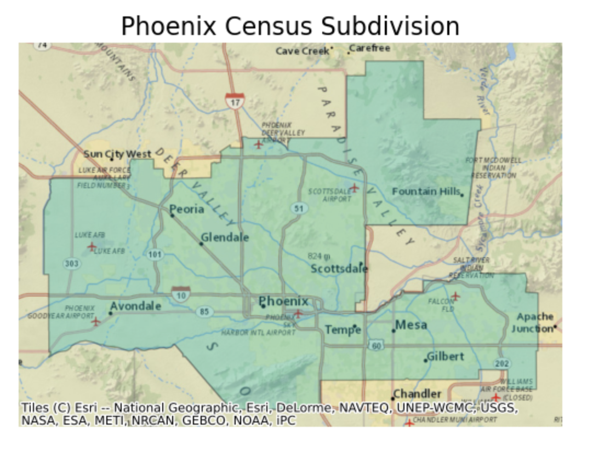
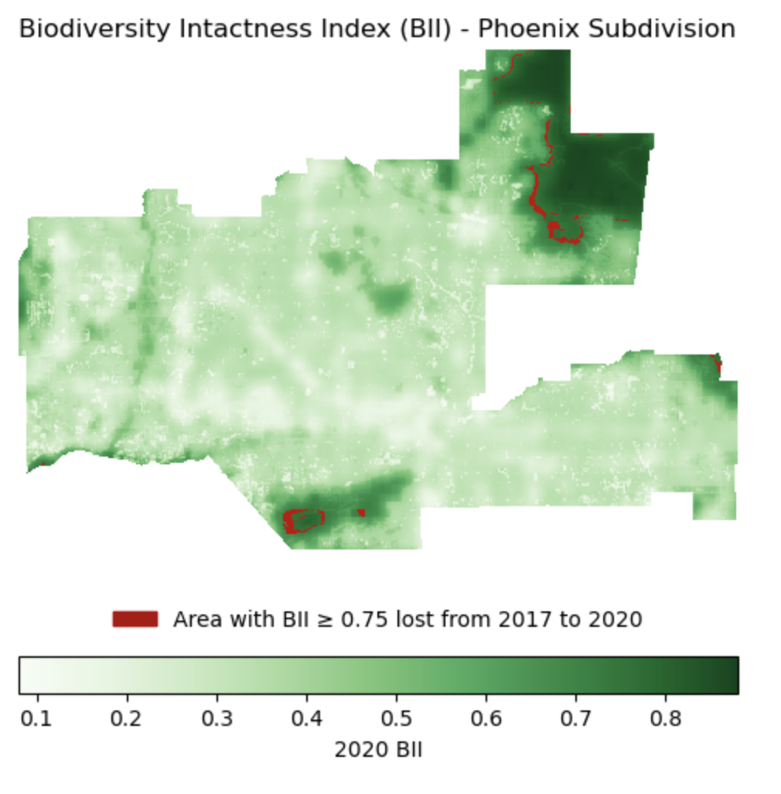

# Biodiveristy Intact Index

# Background 

Between 2001 and 2019, Maricopa County, located in the Phoenix metropolitan area of Arizona, added over 270 miles of developed land. This includes buildings, roads, and other structures which have the potential to disturb and negatively impact biodiversity in surrounding areas. Measures of biodiversity, such as the biodiversity intactness index (BII), are crucial for creating conservation and restoration plans. Global raster data on BII from 2017 to 2020 was produced and published by Impact Observatory. This analysis combines BII data from Impact Observity as U.S. Census shapefile data to analyze changes in BII between 2017 and 2020.
# Analysis highlights:

1. Upload Phoenix .shp and rasters with BII data for 2017 and 2020 from the MPC
2. Clip the rasters to Phoenix gemoetry
3. Calculate % BII change from 2017 to 2020
4. Visualize the areas changed between 2017 and 2020.

# Data Access and Information

1. **BII data**: This dataset is part of the MPC STAC catalog. The data in question is the ‘io-biodiversity’ collection and look for the 2017 and 2020 rasters covering Phoenix subdivision. The coordinates that correspond to Phoenix are: 
[-112.826843, 32.974108, -111.184387, 33.863574]

2. **Phoenix subdivision**: You will find the Phoenix subdivision polygon in the Census County Subdivision shapefiles for Arizona: https://www.census.gov/cgi-bin/geo/shapefiles/index.php?year=2022&layergroup=County+Subdivisions


# Map of Phoenix Subdivision
Here is a map showing the Phoenix subdivision within an appropriate geographical context. You may use any vector datasets to create your map. 


# Assessing Biodiveristy Loss  

Directly calculated the percentage of area of the Phoenix subdivision with a BII of at least 0.75 in 2017. Obtain the same calculation for 2020.

## Proccess to Finding Percentage of Area

The original raster is larger than the Phoenix subdivision, and needs to be cropped and reprojected before percentages can be calculated.

#### Percetange of Area in 2017:
Percentage of Area with BII >= 75% in 2017: 7.13 %

#### Percentage of Area in 2020
Percentage of Area with BII >= 75% in 2017: 6.49 %

#### Analysis





# Visualization of Biodiversity Intact Index

Create a visualization showing the area with BII>=0.75 in 2017 that was lost by 2020.

Cropping BII data to Phoenix subdivision:


# Repository Structure
```
biodiv-index-phx
 │   README.md  
 │   biodiv-index-phx.ipynb      
 │
 └───data
      └───tl_2022_04_cousub
           |  tl_2022_04_cousub.cpg
           |  tl_2022_04_cousub.dbf
           |  tl_2022_04_cousub.prj
           |  tl_2022_04_cousub.shp
           |  tl_2022_04_cousub.shx

```
